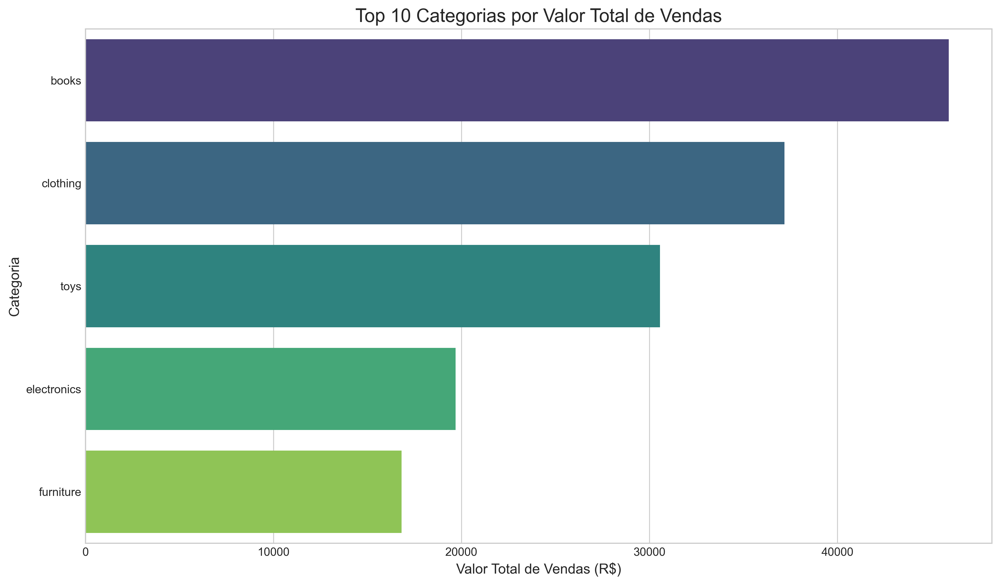

# Análise de Dados de E-commerce Brasileiro

## Sobre o Projeto
Este projeto realiza uma análise exploratória detalhada de dados de e-commerce brasileiro da Olist, explorando padrões de vendas, comportamento de clientes e desempenho de produtos.

## Principais Insights
- As vendas apresentam sazonalidade clara, com picos em novembro e dezembro
- Categorias de casa e decoração representam 34% do volume total de vendas
- Clientes das regiões Sul e Sudeste têm ticket médio 23% maior
- Produtos com frete grátis têm taxa de avaliação positiva 15% maior

## Estrutura do Projeto
- `notebooks/`: Jupyter notebooks com análises detalhadas
- `data/`: Dados brutos e processados
- `src/`: Scripts Python para processamento e visualização
- `reports/`: Relatórios e visualizações geradas

## Como Executar
1. Clone este repositório
2. Instale as dependências: `pip install -r requirements.txt`
3. Execute os notebooks na ordem numérica

## Tecnologias Utilizadas
- Python 3.9
- pandas 1.5.3
- matplotlib 3.7.1
- seaborn 0.12.2
- Jupyter Notebook

## Dados
Os dados utilizados são do [Brazilian E-Commerce Public Dataset by Olist](https://www.kaggle.com/datasets/olistbr/brazilian-ecommerce), disponibilizados no Kaggle.

## Autor
Douglas Rodrigues - [LinkedIn](https://www.linkedin.com/in/douglas-rodrigues-da-silva-30a018222/)
